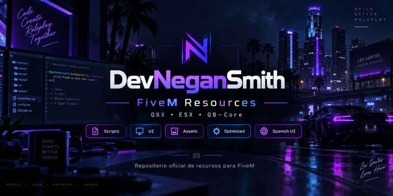

<!-- DEVNEGANSMITH_PREVIEW_START -->
<p align="center">
  
</p>
<!-- DEVNEGANSMITH_PREVIEW_END -->

# DevNeganSmith - Job Announce

Sistema moderno de **anuncios públicos de servicios para FiveM**, diseñado para que trabajos autorizados publiquen avisos globales mediante el comando `/anuncio`.

> Creado y mantenido por **DevNeganSmith**.

## Compatibilidad

| Framework | Estado |
|---|---|
| Qbox / QBX | ✅ Compatible |
| QBCore | ✅ Compatible |
| ESX Legacy | ✅ Compatible |

El recurso incluye adaptadores para los tres frameworks y puede detectar automáticamente el entorno cuando `Config.Framework = 'auto'`.

> La configuración incluida utiliza `Config.Framework = 'auto'`, por lo que el recurso intenta detectar automáticamente Qbox/QBX, QBCore o ESX Legacy.

## Características

- Comando global `/anuncio` para jobs autorizados.
- Validación del job del jugador del lado del servidor.
- Validación de estado de servicio/duty.
- Compatible con Qbox/QBX, QBCore y ESX Legacy.
- NUI moderna, responsive y configurable.
- Anuncios visibles para todos los jugadores.
- Duración configurable; por defecto **10 segundos**.
- Cooldown server-side configurable.
- Longitud máxima del mensaje configurable.
- Ubicación automática mediante coordenadas del jugador.
- Logos independientes por job.
- Colores y estilos configurables por job.
- Cola de anuncios configurable.
- Sonido NUI opcional.
- Sin base de datos.
- Sin SQL.
- Sin polling permanente ni loops innecesarios.

## Jobs incluidos

Por defecto están configurados:

- `police`
- `ambulance`
- `mechanic`

Puedes agregar más trabajos desde `config.lua` sin modificar el código principal.

## Dependencias

El recurso necesita uno de estos frameworks para obtener la información del job:

- Qbox / QBX
- QBCore
- ESX Legacy

No requiere:

- `ox_lib`
- `ox_target`
- base de datos
- SQL

## Instalación

1. Coloca la carpeta `devnegansmith_jobannouce` dentro de tus recursos.

2. Asegúrate de iniciar tu framework antes de este recurso.

3. Añade en `server.cfg`:

```cfg
ensure devnegansmith_jobannouce
```

4. Reinicia el recurso o el servidor.

## Uso

```text
/anuncio Se necesitan unidades en Legion Square
```

El servidor obtiene automáticamente el job del jugador. El usuario no selecciona manualmente el tipo de anuncio, logo, nombre del servicio ni colores.

## Configuración principal

Archivo:

```text
config.lua
```

Configuración incluida:

```lua
Config.Framework = 'auto'
Config.Command = 'anuncio'
Config.Duration = 10000
Config.Cooldown = 30
Config.MaxMessageLength = 150
Config.ShowLocation = true
Config.RequireDuty = true

Config.EnableQueue = true
Config.MaxQueue = 5

Config.Sound = true
Config.SoundVolume = 0.20
Config.Position = 'bottom-center'
```

### Framework

Valores disponibles:

```lua
Config.Framework = 'auto'
Config.Framework = 'qbx'
Config.Framework = 'qbcore'
Config.Framework = 'esx'
```

Para una instalación genérica compatible con varios frameworks se recomienda:

```lua
Config.Framework = 'auto'
```

## Duty

Qbox/QBX y QBCore utilizan el estado `job.onduty`.

ESX Legacy puede exponer `job.onDuty` o `job.onduty`. Algunos forks antiguos no incluyen información de duty.

Para esos casos:

```lua
Config.ESXAssumeOnDutyIfMissing = true
```

- `true`: si ESX no entrega información de duty, el jugador autorizado puede anunciar.
- `false`: si no existe información de duty, el anuncio se bloquea.

## Agregar nuevos jobs

Añade otra entrada dentro de `Config.Jobs`:

```lua
taxi = {
    label = 'SERVICIO DE TAXI',
    subtitle = 'TRANSPORTE DISPONIBLE',
    logo = 'taxi.png',
    accent = '#F1D54A',
    accentSoft = 'rgba(241, 213, 74, 0.20)'
}
```

Después coloca el logo en:

```text
html/img/jobs/taxi.png
```

No es necesario modificar HTML, CSS ni JavaScript.

## Cambiar logos

Los logos se encuentran en:

```text
html/img/jobs/
```

Archivos incluidos:

```text
police.png
ambulance.png
mechanic.png
```

Puedes reemplazarlos manteniendo los mismos nombres o cambiar el nombre del archivo desde `Config.Jobs`.

Se recomienda utilizar PNG transparente y cuadrado, por ejemplo **256×256** o **512×512**.

## Ubicación

Cuando:

```lua
Config.ShowLocation = true
```

el servidor obtiene las coordenadas actuales del jugador y las envía junto con el anuncio.

Cada cliente resuelve la zona y calle mediante natives de GTA V/FiveM.

Si la ubicación no puede resolverse, se muestra:

```text
Ubicación no disponible
```

## Cola de anuncios

```lua
Config.EnableQueue = true
Config.MaxQueue = 5
```

Si llegan varios anuncios mientras uno está visible, los siguientes esperan su turno.

Si la cola está desactivada, el anuncio nuevo puede reemplazar al actual.

## Sonido

```lua
Config.Sound = true
Config.SoundVolume = 0.20
Config.SoundFile = 'sounds/notify.wav'
```

El archivo puede reemplazarse desde:

```text
html/sounds/notify.wav
```

## Posición

Posiciones disponibles:

```lua
Config.Position = 'top-center'
Config.Position = 'top-left'
Config.Position = 'top-right'
Config.Position = 'bottom-center'
```

## Seguridad

Las comprobaciones sensibles se realizan del lado del servidor:

- source válido;
- framework;
- personaje;
- job;
- duty;
- cooldown;
- longitud del mensaje;
- normalización del contenido.

El cliente no decide el job, logo, label ni colores del anuncio.

La NUI inserta el mensaje del jugador mediante `textContent`, evitando utilizar `innerHTML` para ese contenido.

## Eventos internos

Servidor → cliente:

```text
negan_jobannouncements:client:notify
negan_jobannouncements:client:showAnnouncement
```

El anuncio se crea desde el comando registrado en el servidor y no mediante un evento cliente → servidor destinado a generar anuncios.

## Rendimiento

El recurso no utiliza loops `while true` ni polling permanente para mantener el sistema activo.

Cuando no existen anuncios, el cliente mantiene únicamente listeners de eventos y la NUI permanece inactiva.

El consumo esperado en reposo debe ser prácticamente **0.00 ms**, aunque el valor exacto depende del FXServer, hardware, profiler y configuración del servidor.

## Pruebas recomendadas

- Ejecutar `/anuncio` como civil y confirmar que se bloquee.
- Probar cada job autorizado.
- Probar dentro y fuera de servicio.
- Confirmar que todos los jugadores reciben el anuncio.
- Confirmar que aparece el logo correspondiente.
- Confirmar ubicación de calle/zona.
- Confirmar duración de 10 segundos.
- Validar el cooldown.
- Probar mensajes que superen la longitud máxima.
- Probar varios anuncios consecutivos y validar la cola.
- Probar resoluciones 16:9 y 21:9.
- Revisar F8 por errores JavaScript.
- Revisar la consola del servidor por errores Lua.
- Ejecutar `resmon 1` para revisar consumo.

## Estructura

```text
devnegansmith_jobannouce/
├── fxmanifest.lua
├── config.lua
├── client/
│   ├── framework.lua
│   └── main.lua
├── server/
│   ├── framework.lua
│   └── main.lua
├── locales/
│   └── es.lua
├── html/
│   ├── index.html
│   ├── css/style.css
│   ├── js/app.js
│   ├── img/jobs/
│   │   ├── police.png
│   │   ├── ambulance.png
│   │   └── mechanic.png
│   └── sounds/notify.wav
├── LICENSE
└── README.md
```

## Licencia

Distribuido bajo **MIT License**. Consulta [`LICENSE`](LICENSE).

© 2026 **DevNeganSmith**
